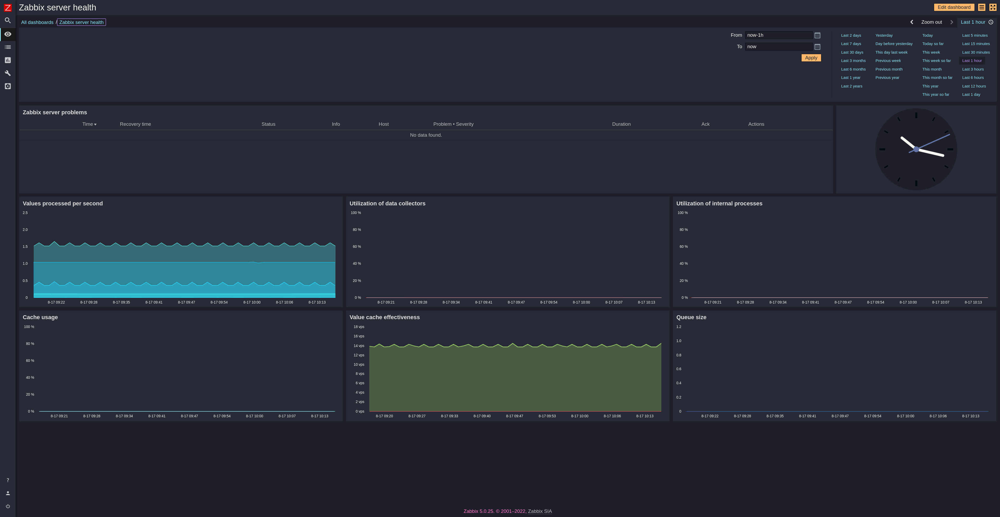

# zabbix 5.0 Naon Theme
Zabbix 5.0 Custom Dark Theme
> A dark theme for [Zabbix 5.0](https://www.zabbix.com/download?zabbix=5.0).

## Install
Copy this repository into Zabbix Server

Execute install.sh

Tested with CentOS-7 and postgresql-12

## Notes
Changing severity background color done by adding entry at graph_theme table in zabbix database

Ref: https://www.zabbix.com/documentation/5.0/en/manual/web_interface/theming
